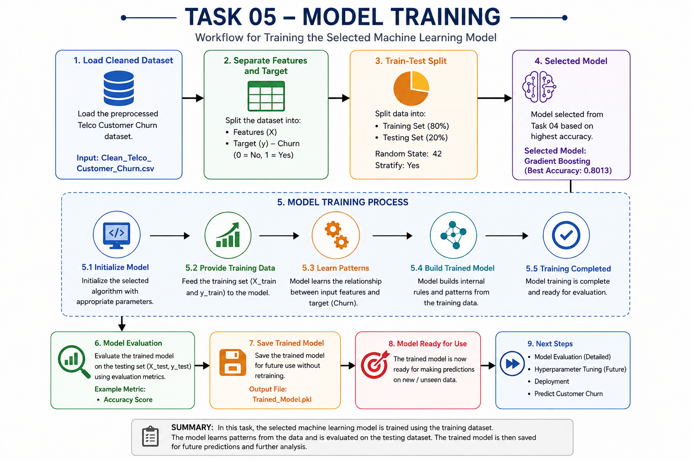
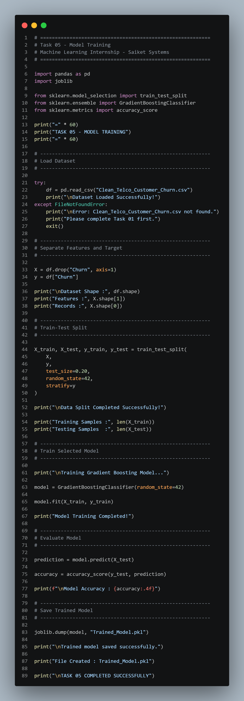
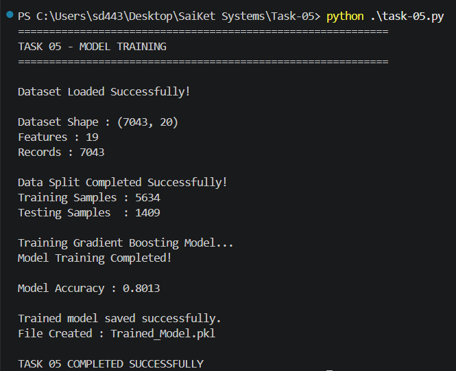

# 📊 Task 05 – Model Training for Customer Churn Prediction

<p align="center">


</p>

---

# 📌 Machine Learning Internship Project

**Organization:** Saiket Systems

**Role:** Machine Learning Intern

**Task:** Task 05 – Model Training

---

# 📖 Project Overview

Model Training is one of the most important stages in the Machine Learning pipeline. After selecting the most suitable algorithm in Task 04, the next step is to train the chosen model using historical customer data.

In this project, the **Gradient Boosting Classifier** was selected because it achieved the highest accuracy (**80.13%**) during model comparison. The model was trained using the **training dataset (80%)**, while the **testing dataset (20%)** was used to evaluate its predictive performance.

Finally, the trained model was saved for future customer churn prediction without the need for retraining.

---

# 🎯 Objectives

* Load the cleaned Telco Customer Churn dataset.
* Separate features (X) and target variable (y).
* Split the dataset into training and testing sets.
* Train the selected Gradient Boosting model.
* Evaluate model performance using Accuracy Score.
* Save the trained model for future predictions.

---

# 📂 Dataset Information

**Dataset:** Telco Customer Churn Dataset

The dataset includes customer information such as:

* Gender
* Senior Citizen
* Partner
* Dependents
* Tenure
* Internet Service
* Contract Type
* Monthly Charges
* Payment Method
* Customer Churn Status

### 🎯 Target Variable

| Value | Description      |
| ----- | ---------------- |
| 1     | Customer Churned |
| 0     | Customer Stayed  |

---

# 🛠 Technologies Used

* Python
* Pandas
* Scikit-learn
* Joblib

---

# 📚 Libraries Used

```python
import pandas as pd
import joblib

from sklearn.model_selection import train_test_split
from sklearn.ensemble import GradientBoostingClassifier
from sklearn.metrics import accuracy_score
```

---

# 🖼 Project Workflow

<p align="center">

</p>

---

# 📸 Project Screenshots

## 💻 Python Code

<p align="center">

</p>

---

## 🖥 Program Output

<p align="center">

</p>

---

## 📊 Model Performance

| Metric         | Value             |
| -------------- | ----------------- |
| Selected Model | Gradient Boosting |
| Training Data  | 80%               |
| Testing Data   | 20%               |
| Accuracy       | **80.13%**        |

---

# 🔄 Machine Learning Workflow

```text
Clean Dataset
      │
      ▼
Load Dataset
      │
      ▼
Separate Features (X)
      │
      ▼
Separate Target (y)
      │
      ▼
Train-Test Split
      │
      ▼
Initialize Gradient Boosting Classifier
      │
      ▼
Train Model Using Training Dataset
      │
      ▼
Predict Customer Churn
      │
      ▼
Evaluate Accuracy
      │
      ▼
Save Trained Model (.pkl)
```

---

# 🤖 Selected Model

## Gradient Boosting Classifier

The **Gradient Boosting Classifier** was selected because it achieved the highest performance among all evaluated models during Task 04.

### Model Comparison

| Model                 |   Accuracy |
| --------------------- | ---------: |
| **Gradient Boosting** | **80.13%** |
| Logistic Regression   |     79.91% |
| Random Forest         |     79.21% |
| Decision Tree         |     73.03% |

### Why Gradient Boosting?

* Highest prediction accuracy.
* Handles complex relationships in structured data.
* Reduces prediction errors by sequentially improving weak learners.
* Produces reliable and robust classification performance.

---

# 📁 Project Structure

```text
Task-05/
│
├── images/
│   ├── workflow.png
│   ├── code.png
│   ├── output.png
│   └── training.png
│
├── task-05.py
├── README.md
├── Clean_Telco_Customer_Churn.csv
├── Gradient_Boosting_Model.pkl
└── requirements.txt
```

---

# ▶️ Installation

```bash
git clone https://github.com/your-username/Task-05.git

cd Task-05

pip install -r requirements.txt
```

---

# ▶️ Run the Project

```bash
python task-05.py
```

---

# 📄 Output Files

The project generates the following output:

* `Gradient_Boosting_Model.pkl` – Saved trained machine learning model for future predictions.

---

# 📚 Key Concepts Learned

* Machine Learning Model Training
* Binary Classification
* Gradient Boosting
* Train-Test Splitting
* Accuracy Evaluation
* Model Serialization with Joblib
* Scikit-learn Workflow

---

# 🚀 Skills Demonstrated

* Python Programming
* Machine Learning
* Data Preprocessing
* Model Training
* Gradient Boosting
* Binary Classification
* Pandas
* Scikit-learn
* Joblib
* Data Analysis

---

# 📖 Learning Outcome

Through this project, I gained practical experience in training a machine learning model using real-world customer churn data. I learned how to prepare training and testing datasets, train a Gradient Boosting Classifier, evaluate its performance using accuracy, and save the trained model for future use. This task strengthened my understanding of the complete model training process and reinforced the importance of selecting an appropriate algorithm for binary classification problems.

---

# 🙏 Acknowledgement

This project was completed as **Task 05** during my **Machine Learning Internship at Saiket Systems**. It provided valuable hands-on experience in training and evaluating machine learning models for customer churn prediction.

---

# 👨‍💻 Author

**Shaikh Danish**

Machine Learning Intern | AI & ML Enthusiast

* 🌐 GitHub:  [https://github.com/SKDANISHO7](https://github.com/SKDANISHO7)
* 💼 LinkedIn: [https://linkedin.com/in/shaikh-danish-70879328a](https://www.linkedin.com/in/shaikh-danish-70879328a)

---

<p align="center">

⭐ If you found this project useful, consider giving this repository a **Star**!

</p>
